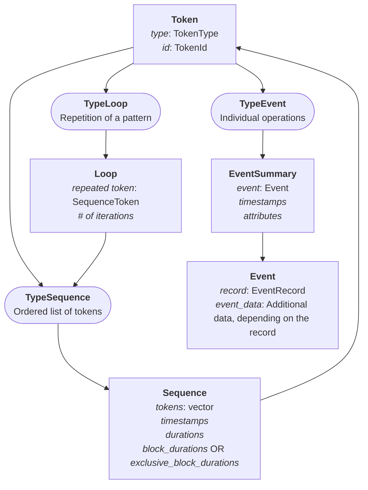
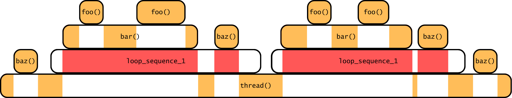

Pallas is a new trace format whose goal is to speed up post-morterm analysis.
It provides a clean C/C++ writing API, as well as API for reading traces in both C, C++ and Python.

## Learning about Pallas
Pallas is tailored for HPC applications.
Most HPC apps are very repetitive:
they will do the same sequence of calls to functions a million, billion times.
We have decided to leverage this and use it to speed up analysis.
There are two main ways we use this:
- First, we detect repetitions in functions to compress the [grammar](#grammar) of a trace
- Then, we store data in a way that makes it easily accessible **on demand**

These two points are enough to make post-mortem analyses faster and more convenient,
at the cost of making Pallas more complex to read.

### Trace structure
Pallas harbours a **hierarchical** trace structure, based on the hierarchy of a multi-process, multi-threaded application.
- The application in itself is represented by the **GlobalArchive** class. It contains:
    - Program-wide [definitions](#definitions) and metadata (such as the compression type);
    - The **LocationGroups** mapping, which identify Archives;
    - User-defined custom data.
- **Processes** are represented by the **Archives** class. They are identified by a **LocationGroup**. They contain:
    - Local [definitions](#definitions), which override the global ones;
    - The **Locations** mapping, which identify Threads.
- **Threads** are represented by the **Thread** class. They are identified by a **Location**. Each Thread will then store its grammar and its data:
    - The [grammar](#grammar) of a thread describes what's happened during this thread's execution.
    - The [data](#performance-data) of a thread is made of performance metrics linked to the grammar.

They are then stored in the following pattern:
```terminal
>|tree root_trace_folder
root_folder/
├── main.pallas                         # GlobalArchive file
├── archive_0/
│   ├── archive.pallas                  # Archive file
│   ├── thread_0
│   │   ├── event_durations.dat         # Data file
│   │   ├── sequence_durations.dat      # Data file
│   │   └── thread.pallas               # Thread file ( Grammar )
│   └── thread_1
│       └── ...
├── archive_1/
│   └── ...
└── ... 
```
Since each process and thread has its own folder, it enables highly parallel read / write performance on NFS,
without ruining your performance.
The only thing that needs to be loaded manually by the user is the GlobalArchive.
Archives, threads, and their data are then loaded on-demand.
The thread data is also unloaded when necessary, using a simple FIFO rule.
See more in section [Custom Vectors](#custom-vectors).


### Grammar
Pallas uses a unified token system to reference all trace elements through a single Token structure.
This design provides a consistent interface for handling different types of trace constructs.
The Token structure provides a 32-bit unified reference where the first 2 bits encode the type, and 30 bits store the ID.
This compact representation enables efficient storage and lookup:
- **Event**: References single operations like function entries/exits, or fixed point information.
- **Sequence**: References ordered collections of tokens. There are two types of sequences:
    - **_Block_** Sequences represent blocks of code delimited by an _Enter_ and a _Leave_ Event (most often calls to a intercepted function)
    - **_Loop_** Sequences represent repeating patterns of Tokens.
- **Loop**: References repetitive patterns detected during trace recording. Links to a Loop Sequence.



### Definitions
Events defined in Pallas may refer to custom _**Definition**_.
Definitions may refer to:
- Strings ( thread names, function names, etc. )
- Regions ( specific regions of code _e.g._ functions )
- Attributes ( function attributes )
- Groups ( _e.g._ a specific group of processes )
- Comms (  _e.g._ MPI communication groups )

Any object stored in a trace's definitions can be referred to by a 32-bit integer called a _reference_.
For example, the `Enter` event stores a 32-bit reference pointing to the Region it is entering.
As presented in the [previous section](#trace-structure), local definitions override global ones.
Also, since the global definitions are stored in the GlobalArchive,
which is most often not an object that is shared by the multiples processes,
you should be careful when using global definitions.

Locations and LocationGroups are also considered definitions:
Locations should be stored locally ( as they refer to Threads ), whereas LocationGroups are stored globally.
Both Locations and LocationGroups refer to a parent LocationGroup, allowing you to create complex hierarchical structures.
The "root" LocationGroup will have `-1` as its parent's reference.

### Performance data
Whenever an event is logged in Pallas, it will be associated with a **timestamp**.
Whenever a sequence (be it a _Loop_ or a _Block_ Sequence) is detected, the timestamps of their first and last events
is used to deduce the **duration** of the sequence.
For sequences, we also compute another metric:
- their **_exclusive blocks duration_** if they are a _Block_ sequence, which measures the time **not** spent in another _Block_ sequence;
- their **_blocks duration_** if they are a _Loop_ sequence, which measures the time spent in _Block_ sequences.

In the following example, we have drawn a typical hierarchy of sequences you might encounter in Pallas.
For the sake of clarity, events are not represented.
The durations of each sequence is represented by the length of their rectangle (think of it as some sort of Gantt diagram).
The `foo`, the `bar`, the `baz`, and the `thread` sequences represent functions, and are thus _Block_ sequences.
The latter represents the whole thread execution.
The area coloured in <span style="color:orange">orange</span> represents the _exclusive blocks duration_.
In this execution, there is a loop, made from the following tokens:
- At least one Event ( bear in mind that they are not represented, but since the sequence starts before the beginning of `bar`, it means there are some Events )
- A call to `bar`
- Possibly some Events
- A call to `baz`
- At least one Event

This forms the `loop_sequence_1` _Loop_ sequence.
The area coloured in <span style="color:red">red</span> represents its _blocks duration_.





The blocks duration is a metric that is especially useful when you want to measure the impact of a library in a specific
loop: you just have to sum the blocks durations of the Loop Sequence.
If you want a more global metric ( across the whole trace for example ), then you can compute the sum of the exclusive blocks durations
of Block sequences from a specific library: this prevents your data from being skewed
(by counting certain functions, such as `foo` in this case, multiple times).

#### Custom Vectors
Both timestamps and durations have a common point: they are always appended at the end of their containers,
and, when writing the trace, we never need to fetch the ones we appended a long time ago.
This drove us to design a custom container to hold our data: **Linked Vectors**.
They are doubled-linked array list, and their base skeleton is very basic:

```cpp
class LinkedVector {
    size_t size;               // Number of elements in the vector
    class SubArray {
        size_t size;           // Number of elements in the array
        size_t allocated;      // Size of the array
        uint64_t * timestamps; // Data
        SubArray* next;
        SubArray* previous;
    }
    SubArray* first;
    SubArray* last;
}
```
However, this basic skeleton is expanded depending on the type stored:
- _**LinkedVector**_ is the container for timestamps,
  and their SubArrays also contain the value for the first and the last timestamp they contain.
- _**LinkedDurationVector**_ is the container for the durations,
  and they, as well as their SubArrays, contain the minimum, the maximum, and the mean of the durations they hold.

This structure and these redundancies in data allows Pallas to quickly fetch general data without having to read the data files.
This also allows Pallas to write the performance data during the execution, lowering the memory overhead.
These blocks are compressed, written on the file, and the offset of that file is stored in the SubArray.
This allows us to load the data **on-demand** when reading the trace, since we know exactly where it is stored.

## Building Pallas
### Requirements
The following software are **required**:
- git
- cmake
- C++ compiler >=17
- pkg-config
- ZSTD (compression library used by Pallas)

To install all the required packages on Debian, you can run:
```bash
sudo apt install build-essential cmake git libzstd-dev pkg-config
```

#### Optional requirements
If you wish, you can also build the Python API of Pallas.
Doing so requires having [PyBind11](https://pybind11.readthedocs.io/en/stable/).
```bash
sudo apt install python3 python3-pip python3-pybind11
```
Pallas traces are compressed with ZSTD by default, but you can add [SZ](https://github.com/szcompressor/SZ3)
and [ZFP](https://zfp.readthedocs.io/en/release0.5.5/installation.html) compression as well.
Be aware that those are lossy compressions, and may well cause issues in the trace coherence.

Pallas can also be built with MPI, OpenMP and PThreads tests.
```bash
sudo apt install mpich libomp-dev
```

### Building Pallas
Just as any CMake library, you can start with
```bash
git clone https://gitlab.inria.fr/pallas/pallas
mkdir -p pallas/build && cd pallas/build
cmake ..
cmake --install . --config Release # You will probably need sudo to run it like that
```

Pallas has a few CMake variables you can edit:

| Name                      | Description                                                                   | Values   |
|---------------------------|-------------------------------------------------------------------------------|----------|
| `ENABLE_OTF2`             | Build the OTF2 compatibility library. Enable this if you want to use EZTrace. | ON / OFF |
| `BUILD_DOC`               | Build the doxygen documentation. Requires the Doxygen library.                | ON / OFF |
| `ENABLE_SZ`               | Build Pallas with SZ support.                                                 | ON / OFF |
| `ENABLE_ZFP`              | Build Pallas with ZFP support.                                                | ON / OFF |
| `ENABLE_PYTHON`           | Build the Pallas Python library.                                              | ON / OFF |
| `Python3_INSTALL_LOCALLY` | Install the Pallas Python library for the user instead of system-wide.        | ON / OFF |

Pallas also has a few compile-time macros which you can configure in `libraries/pallas/include/pallas/pallas_config.h.in`.
These are mostly related to the initial size of arrays used when writing Pallas traces.

Pallas also has a run-time configuration file. You can configure the default file in `libraries/pallas/pallas.config`.
Each entry in that configuration file can be overwritten by the environment variable of the same name.
You can also give your own custom configuration file with the `PALLAS_CONFIG_PATH` environment variable.

#### Building EZTrace with Pallas support
Building EZTrace with Pallas should be no different from building EZTrace with OTF2.
There are two crucial steps:
- Make sure you built and installed Pallas with the `ENABLE_OTF2=ON` CMake build flag.
- Make sure Pallas is loaded in your path when configuring CMake for EZTrace. You can check that with `otf2-config | grep Pallas`.


#### Building with Pallas
We recommend using `pkg-config` to get the correct flags when building with Pallas.
```bash
gcc youfile.c $(pkg-config --libs pallas)  $(pkg-config --cflags pallas) 
```

You can also use CMake:
```cmake
pkg_check_modules(PALLAS pallas REQUIRED)
target_link_libraries(my-lib PRIVATE ${PALLAS_LIBRARIES})
target_link_directories(my-lib PRIVATE ${PALLAS_LIBRARY_DIRS})
```

## Using Pallas
This section assumes you've read ["Learning about Pallas"](#learning-about-pallas).
A global rule when using the Pallas library is to ***never copy an object***.
Always use pointers and references when possible: the memory management is made by the Pallas library internally,
you should ***not*** have to deal with it.

You should always start by creating a single `GlobalArchive`.
Again, this object should never be duplicated, or you will risk issues with duplications.
You can then begin defining your LocationGroups for your Archives, or some global definitions.
Once an Archive has been created, you can create your Locations for your Threads.
```cpp
#include <pallas/pallas_write.h>
int main() {
      GlobalArchive globalArchive("<my_trace_name>", "<file_name>");
      // This will create the <my_trace_name> folder, and the main trace will be called <file_name>
      StringRef processName = globalArchive.registerString("Main process");
      globalArchive.defineLocationGroup(0, processName, -1);
      // The first LocationGroup has no parent, hence -1
      Archive mainProcess(globalArchive, 0);
      // On other processes where globalArchive is not accessible, one can use the other constructor:
      // Archive mainProcess("<my_trace_name>", mpi_rank);
      StringRef threadName = archive.registerString("Main Thread");
      mainProcess.defineLocation(threadID, threadName, 0);
      // threadID is whatever you want
      // 0 is the parent's ID
      ThreadWriter threadWriter(archive, threadID);
      // This automatically creates a Thread in the Archive, and handles the memory of said Thread.
}
```
Once all that is done, you can begin logging your events.
Before logging an event, you might have to register Strings, Regions, Definitions, etc.
It is recommended to do that before the execution starts, otherwise it might interfere with your performance (although it's most likely negligible).
```cpp
int main() {
    /** Previous stuff ... **/
    StringRef functionName = globalArchive.registerString("Common Function");
    RegionRef commonFunction = myCustomFunctionId;
    globalArchive.addRegion(commonFunction, functionName);
    // This register a region to be used globally.
    // You can do that same for local regions
    // Be aware that any local definition will overwite global definitions
    // So be carefull or you'll end up with traces that make no sense.
    pallas_record_<event_type>(&threadWriter, args...);
}
```

Once the execution is finished, you need to write the Threads, Archives and GlobalArchive manually.
```cpp
int main() {
    /** End of Execution **/
    threadWriter.threadClose();
    mainProcess.store();
    globalArchive.store();
}
```
### Storing custom data
There are two ways a user might want to store custom data in Pallas:
either in the GlobalArchive/Archive (for information about the execution, for example),
or in an Event (for information concerning a specific logged event).
The former can be done by using the `AdditionalData<T>` template, which takes a pointer and a writer function 
(allowing you to create complex ways of writing your custom data):
```cpp
// Define a custom structure that holds the data
struct ExampleData {
    std::string name;
    size_t random_number;
};
// Define a custom function that writes the data to a file
size_t write_example_data(example_data* d, FILE* file) {
    return fwrite(d, sizeof(example_data), 1, file);
}

// Then adding the example data to the archive would look like this:
void record_example_data(pallas::Archive& archive) {
      ExampleData data{"TestData", 42};
      AdditionalContent<ExampleData> content{&data, &write_example_data};
      archive.add_content(&content);
}
```

Custom data in Events cannot currently be done at runtime.
However, it is quite easy to add your own custom events.