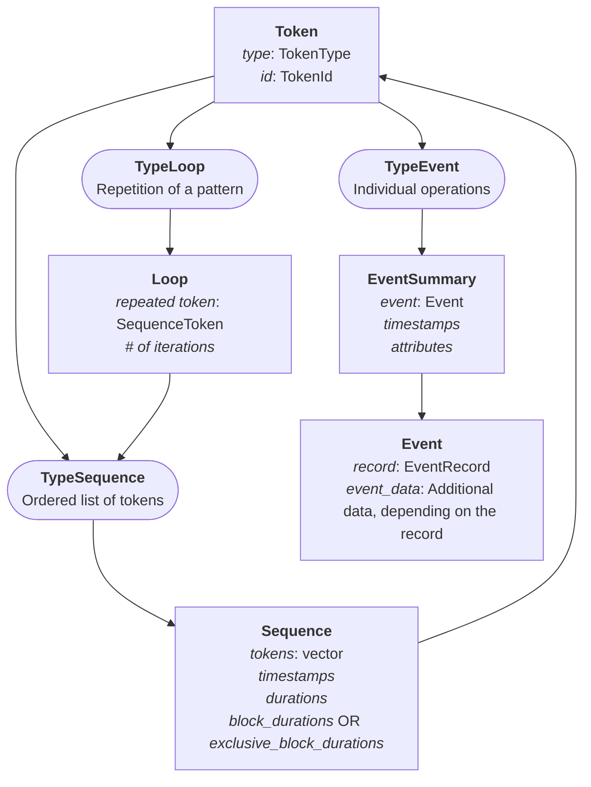
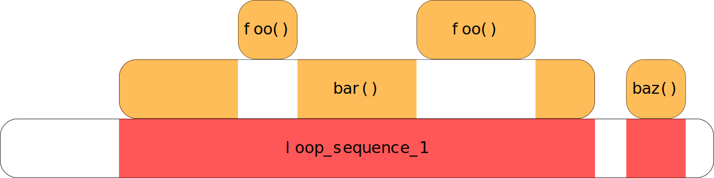

# Presentation of Pallas Trace Format
Pallas is a new trace format whose goal is to speed up post-morterm analysis.
It provides a clean C/C++ writing API, as well as API for reading traces in both C, C++ and Python.

## Introduction
Pallas is tailored for HPC applications. 
Most HPC apps are very repetitive: 
they will do the same sequence of calls to functions a million, billion times.
We have decided to leverage this and use it to speed up analysis.
There are two main ways we use this:
- First, we detect repetitions in functions to compress the [grammar](#grammar) of a trace
- Then, we store data in a way that makes it easily accessible **on demand**

These two points are enough to make post-mortem analyses faster and more convenient, 
at the cost of making Pallas more complex to read.

## Trace structure
Pallas harbours a **hierarchical** trace structure, based on the hierarchy of a multi-process, multi-threaded application.
 - The application in itself is represented by the **GlobalArchive** class. It contains:
   - Program-wide [definitions](#definitions) and metadata (such as the compression type);
   - The **LocationGroups** mapping, which identify Archives;
   - User-defined custom data.
 - **Processes** are represented by the **Archives** class. They are identified by a **LocationGroup**. They contain:
   - Local [definitions](#definitions), which override the global ones;
   - The **Locations** mapping, which identify Threads.
 - **Threads** are represented by the **Thread** class. They are identified by a **Location**. Each Thread will then store its grammar and its data:
   - The [grammar](#grammar) of a thread describes what's happened during this thread's execution.
   - The [data](#performance-data) of a thread is made of performance metrics linked to the grammar.

They are then stored in the following pattern:
```terminal
>|tree root_trace_folder
root_folder/
├── main.pallas                         # GlobalArchive file
├── archive_0/
│   ├── archive.pallas                  # Archive file
│   ├── thread_0
│   │   ├── event_durations.dat         # Data file
│   │   ├── sequence_durations.dat      # Data file
│   │   └── thread.pallas               # Thread file ( Grammar )
│   └── thread_1
│       └── ...
├── archive_1/
│   └── ...
└── ... 
```
Since each process and thread has its own folder, it enables highly parallel read / write performance on NFS, 
without ruining your performance.
The only thing that needs to be loaded manually by the user is the GlobalArchive.
Archives, threads, and their data are then loaded on-demand. 
The thread data is also unloaded when necessary, using a simple FIFO rule. 
See more in section [Custom Vectors](#custom-vectors).


## Grammar
Pallas uses a unified token system to reference all trace elements through a single Token structure. 
This design provides a consistent interface for handling different types of trace constructs.
The Token structure provides a 32-bit unified reference where the first 2 bits encode the type, and 30 bits store the ID. 
This compact representation enables efficient storage and lookup:
- **Event**: References single operations like function entries/exits, or fixed point information. 
- **Sequence**: References ordered collections of tokens. There are two types of sequences:
  - **_Block_** Sequences represent blocks of code delimited by an _Enter_ and a _Leave_ Event (most often calls to a intercepted function)
  - **_Loop_** Sequences represent repeating patterns of Tokens.
- **Loop**: References repetitive patterns detected during trace recording. Links to a Loop Sequence.



### Definitions
Events defined in Pallas may refer to custom _**Definition**_. 
Definitions may refer to:
- Strings ( thread names, function names, etc. )
- Regions ( specific regions of code _e.g._ functions )
- Attributes ( function attributes )
- Groups ( _e.g._ a specific group of processes )
- Comms (  _e.g._ MPI communication groups )

Any object stored in a trace's definitions can be referred to by a 32-bit integer called a _reference_.
For example, the `Enter` event stores a 32-bit reference pointing to the Region it is entering.
As presented in the [previous section](#trace-structure), local definitions override global ones.
Also, since the global definitions are stored in the GlobalArchive,
which is most often not an object that is shared by the multiples processes, 
you should be careful when using global definitions.

Locations and LocationGroups are also considered definitions: 
Locations should be stored locally ( as they refer to Threads ), whereas LocationGroups are stored globally.
Both Locations and LocationGroups refer to a parent LocationGroup, allowing you to create complex hierarchical structures.
The "root" LocationGroup will have `-1` as its parent's reference.

## Performance data
Whenever an event is logged in Pallas, it will be associated with a **timestamp**.
Whenever a sequence (be it a _Loop_ or a _Block_ Sequence) is detected, the timestamps of their first and last events
is used to deduce the **duration** of the sequence.
For sequences, we also compute another metric: 
- their **_exclusive blocks duration_** if they are a _Block_ sequence, which measures the time **not** spent in another _Block_ sequence;
- their **_blocks duration_** if they are a _Loop_ sequence, which measures the time spent in _Block_ sequences.

In the following example, we have drawn a typical hierarchy of sequences you might encounter in Pallas.
For the sake of clarity, events are not represented.
The durations of each sequence is represented by the length of their rectangle (think of it as some sort of Gantt diagram).
The `foo`, the `bar`, and the `baz` sequences represent functions, and are thus _Block_ sequences.
The area coloured in <span style="color:orange">orange</span> represents the _exclusive blocks duration_.
These sequences are part of a loop, and are thus contained inside a _Loop_ sequence.
The area coloured in <span style="color:red">red</span> represents its _blocks duration_.





The blocks duration is a metric that is especially useful when you want to measure the impact of a library in a specific
loop: you just have to sum the blocks durations of the Loop Sequence.
If you want a more global metric ( across the whole trace for example ), then you can compute the sum of the exclusive blocks durations
of Block sequences from a specific library: this prevents your data from being skewed
(by counting certain functions, such as `foo` in this case, multiple times).

### Custom Vectors
Both timestamps and durations have a common point: they are always appended at the end of their containers,
and, when writing the trace, we never need to fetch the ones we appended a long time ago.
This drove us to design a custom container to hold our data: **Linked Vectors**.
They are doubled-linked array list, and their base skeleton is very basic:

```cpp
class LinkedVector {
    size_t size;               // Number of elements in the vector
    class SubArray {
        size_t size;           // Number of elements in the array
        size_t allocated;      // Size of the array
        uint64_t * timestamps; // Data
        SubArray* next;
        SubArray* previous;
    }
    SubArray* first;
    SubArray* last;
}
```
However, this basic skeleton is expanded depending on the type stored:
- _**LinkedVector**_ is the container for timestamps, 
and their SubArrays also contain the value for the first and the last timestamp they contain.
- _**LinkedDurationVector**_ is the container for the durations, 
and they, as well as their SubArrays, contain the minimum, the maximum, and the mean of the durations they hold.

This structure and these redundancies in data allows Pallas to quickly fetch general data without having to read the data files.
This also allows Pallas to write the performance data during the execution, lowering the memory overhead.
These blocks are compressed, written on the file, and the offset of that file is stored in the SubArray.
This allows us to load the data **on-demand** when reading the trace, since we know exactly where it is stored.