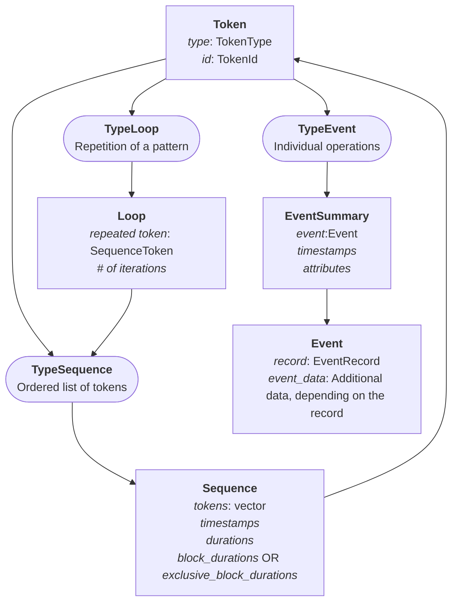

# Presentation of Pallas Trace Format
Pallas is a new trace format whose goal is to speed up post-morterm analysis.
It provides a clean C/C++ writing API, as well as API for reading traces in both C, C++ and Python.

- [Introduction](#introduction) 
- [Grammar](#grammar)


## Introduction
Pallas is tailored for HPC applications. 
Most HPC apps are very repetitive: 
they will do the same sequence of calls to functions a million, billion times.
We have decided to leverage this and use it to speed up analysis.
There are two main ways we use this:
- First, we detect repetitions in functions to compress the [grammar](#grammar) of a trace
- Then, we store data in a way that makes it easily accessible *on demand*

These two points are enough to make post-mortem analyses faster and more convenient, 
at the cost of making Pallas more complex to read.

## Trace structure
Pallas harbours a **hierarchical** trace structure, based on the hierarchy of a multi-process, multi-threaded application.
 - The application in itself is represented by the **GlobalArchive** class. It contains:
   - Program-wide [definitions](#definitions) and metadata (such as the compression type);
   - The **LocationGroups** mapping, which identify Archives;
   - User-defined custom data.
 - **Processes** are represented by the **Archives** class. They are identified by a **LocationGroup**. They contain:
   - Local [definitions](#definitions), which override the global ones;
   - The **Locations** mapping, which identify Threads.
 - **Threads** are represented by the **Thread** class. They are identified by a **Location**. Each Thread will then store its grammar and its data:
   - The [grammar](#grammar) of a thread describes what's happened during this thread's execution.
   - The [data](#performance-data) of a thread is made of performance metrics linked to the grammar.

They are then stored in the following pattern:
```text
root_folder/
├── main.pallas                         # GlobalArchive file
├── archive_0/
│   ├── archive.pallas                  # Archive file
│   ├── thread_0
│   │   ├── event_durations.dat         # Data file
│   │   ├── sequence_durations.dat      # Data file
│   │   └── thread.pallas               # Thread file ( Grammar )
│   └── thread_1
│       └── ...
├── archive_1/
│   └── ...
└── ... 
```
Since each process and thread has its own folder, it enables highly parallel read / write performance on NFS, 
without ruining your performance.
The only thing that needs to be loaded manually by the user is the GlobalArchive.
Archives, threads, and their data are then loaded on-demand. 
The thread data is also unloaded when necessary, using a simple FIFO rule. 
See more in section [Custom Vectors](#custom-vectors).


## Grammar
Pallas uses a unified token system to reference all trace elements through a single Token structure. 
This design provides a consistent interface for handling different types of trace constructs.
The Token structure provides a 32-bit unified reference where the first 2 bits encode the type, and 30 bits store the ID. 
This compact representation enables efficient storage and lookup:
- **Event**: References single operations like function entries/exits, or fixed point information. 
- **Sequence**: References ordered collections of tokens. There are two types of sequences:
  - **_Block_** Sequences represent blocks of code delimited by an _Enter_ and a _Leave_ Event (most often calls to a intercepted function)
  - **_Loop_** Sequences represent repeating patterns of Tokens.
- **Loop**: References repetitive patterns detected during trace recording. Links to a Loop Sequence.



## Performance data