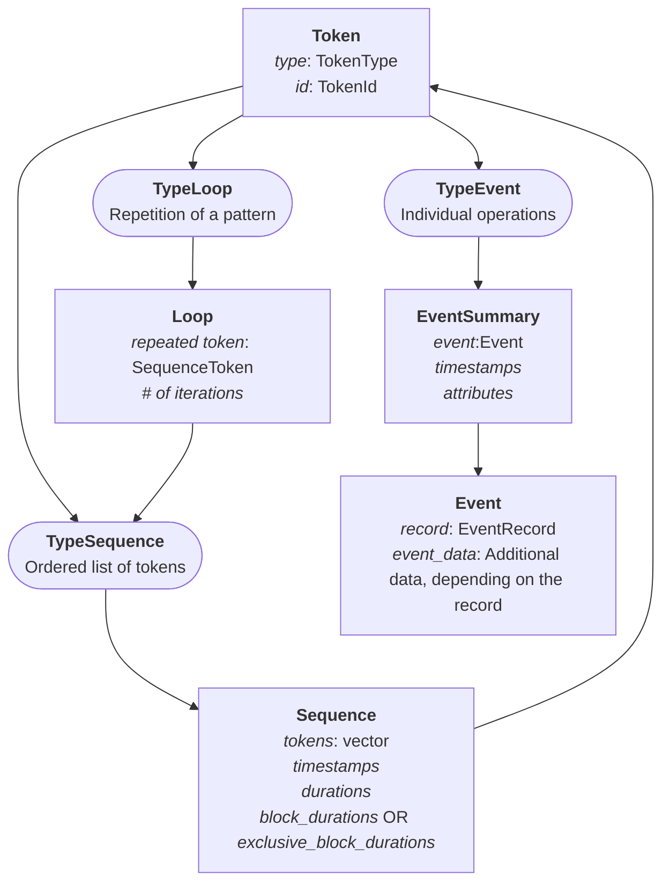

```mermaid
flowchart TD
    Token["`**Token** 
    *type*: TokenType
    *id*: TokenId`"]

    TypeEvent(["`**TypeEvent**
    Individual operations`"])

    TypeSequence(["`**TypeSequence**
    Ordered list of tokens`"])

    TypeLoop(["`**TypeLoop**
    Repetition of a pattern
    `"])

    EventSummary["`**EventSummary**
    *event*:Event
    *timestamps*
    *attributes*
    `"]

    Event["`**Event**
    *record*: EventRecord
    *event_data*: Additional data, depending on the record`"]

    Sequence["`**Sequence**
    *tokens*: vector<Token>
    *timestamps*
    *durations*
    *block_durations* OR *exclusive_block_durations*
    `"]

    Loop["`**Loop**
    *repeated token*: SequenceToken
    *# of iterations*
    `"]

    Token --> TypeEvent
    Token --> TypeSequence
    Token --> TypeLoop
    TypeEvent --> EventSummary
    TypeSequence --> Sequence
    TypeLoop --> Loop
    EventSummary --> Event
    Loop --> TypeSequence
    Sequence --> Token
```